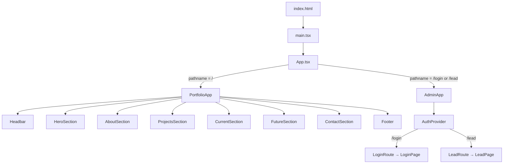
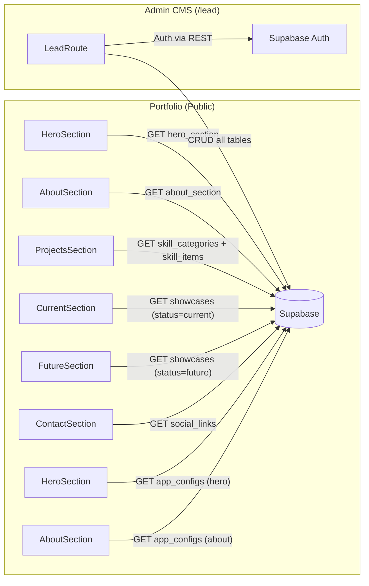
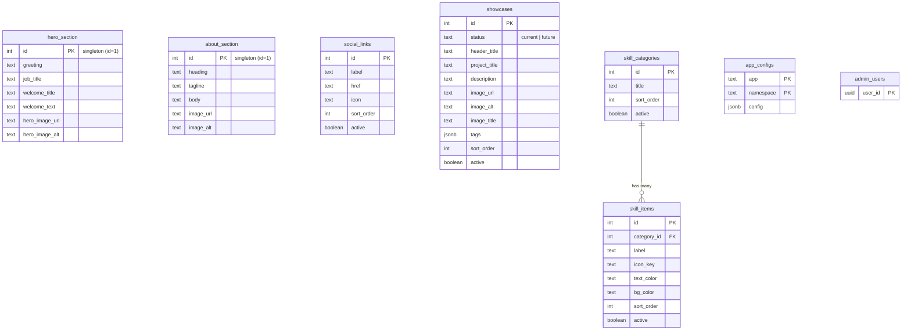

# 📋 Project Analysis: Portofolio

## Overview

**Portofolio** adalah sebuah **personal portfolio website** dengan **built-in admin CMS**, dibangun menggunakan:

| Layer | Technology |
|-------|-----------|
| Build tool | Vite 5 |
| UI Framework | React 18 + TypeScript |
| Backend / DB | Supabase (REST API langsung, **tanpa** `@supabase/supabase-js`) |
| Icons | FontAwesome + Custom SVG components |
| Animations | particles.js (CDN), Typewriter effect (custom) |
| Alerts | SweetAlert2 |
| Deployment | Cloudflare Pages (SPA fallback via `_redirects`) |

---

## Architecture

Satu build Vite menghasilkan 2 "sub-app" dalam satu SPA:



### Routing

Routing dilakukan **secara manual** tanpa library:
- `src/lib/navigation.ts` — `navigateTo()` menggunakan `history.pushState` + custom `popstate` event
- `src/App.tsx` — switch sederhana berdasarkan `pathname`

### Easter Egg 🥚
Logo `</>` di headbar: **triple-click cepat** (< 450ms gap) membuka halaman `/login`.

---

## Data Flow



### Supabase REST Client

`src/lib/supabaseRest.ts` (465 baris) — implementasi **custom REST client** tanpa SDK:

| Function | Purpose |
|----------|---------|
| `supabaseGet<T>()` | SELECT via GET |
| `supabaseUpsert<T>()` | INSERT/UPDATE via POST |
| `supabasePatch<T>()` | UPDATE via PATCH |
| `supabaseDelete()` | DELETE via DELETE |
| `signInWithPassword()` | Auth login |
| `refreshAccessToken()` | Token refresh |
| `getValidAccessToken()` | Auto-refresh jika expired |
| `storagePublicUrl()` | Public Storage URL builder |
| `uploadStorageObject()` | File upload ke Storage |
| `listStorageBuckets/Objects()` | Storage browsing |
| `signStorageObjectUrl()` | Signed URL untuk private files |

Session disimpan di `localStorage` dengan key `portfolio_supabase_session_v1`.

---

## Database Schema



### RLS (Row Level Security)
- **Public read** — Semua tabel portfolio bisa dibaca tanpa auth (anon key)
- **Admin write** — Hanya user yang ada di `admin_users` (via `is_admin()` function) yang bisa write
- `app_configs` — Public read hanya untuk `app = 'portfolio'`

---

## File Structure

```
Portofolio/
├── src/
│   ├── main.tsx                          # React bootstrap
│   ├── App.tsx                           # Route switch (portfolio vs admin)
│   ├── index.css                         # Global styles
│   ├── App.css                           # App-level styles
│   │
│   ├── lib/
│   │   ├── supabaseRest.ts              # Custom Supabase REST client (465 lines)
│   │   └── navigation.ts                # Custom routing (pushState)
│   │
│   ├── shared/
│   │   ├── types/
│   │   │   ├── heroSettings.ts          # Hero config type + normalizer
│   │   │   └── aboutSettings.ts         # About config type + normalizer
│   │   └── ui/
│   │       ├── BrickListInput.tsx        # Multi-value input component
│   │       ├── DbStatusIndicator.tsx     # Connection status badge
│   │       ├── StorageImagePicker.tsx    # Supabase Storage browser
│   │       └── TripleProgressButton.tsx  # Save button with states
│   │
│   ├── apps/
│   │   ├── portfolio/
│   │   │   ├── PortfolioApp.tsx          # Section composition
│   │   │   ├── page-sections/
│   │   │   │   ├── HeroSection.tsx       # Hero with particles + typewriter
│   │   │   │   ├── AboutSection.tsx      # Bio + photo
│   │   │   │   ├── ProjectSections.tsx   # Skills grid (categories + items)
│   │   │   │   ├── CurrentSection.tsx    # Current project showcase
│   │   │   │   ├── FutureSections.tsx    # Upcoming projects
│   │   │   │   ├── ContactSection.tsx    # Social links
│   │   │   │   └── footer.tsx            # Footer
│   │   │   ├── components/
│   │   │   │   ├── headbar.tsx           # Navigation bar
│   │   │   │   ├── ShowcaseCard.tsx      # Project card
│   │   │   │   ├── TypewriterText.tsx    # Animated typing effect
│   │   │   │   ├── SweetAlert.tsx        # Alert wrapper
│   │   │   │   ├── transition.tsx        # Section transitions
│   │   │   │   ├── icons/               # Custom SVG icon components
│   │   │   │   ├── styles/              # CSS per section
│   │   │   │   └── configs/             # particles.js config
│   │   │   ├── data/
│   │   │   │   ├── skillIcons.ts         # Icon key → Component map
│   │   │   │   ├── ProjectData.tsx       # Fallback data types
│   │   │   │   └── showcase.ts           # Fallback showcase data
│   │   │   ├── assets/                   # Static images
│   │   │   └── types/                    # particles.js type declaration
│   │   │
│   │   └── admin/
│   │       ├── AdminApp.tsx              # AuthProvider + route switch
│   │       ├── lib/auth.tsx              # Auth context (loading/anonymous/member/admin)
│   │       ├── routes/
│   │       │   ├── LoginRoute.tsx        # Login flow + redirect
│   │       │   └── LeadRoute.tsx         # Data management (load/save/delete all tables)
│   │       └── pages/
│   │           ├── LoginPage.tsx          # Login UI
│   │           ├── LeadPage.tsx           # Admin CMS UI (66KB! very large)
│   │           └── styles/               # Admin CSS
│   │
│   └── components/
│       └── headbar.tsx                   # (unused? duplicate from portfolio)
│
├── supabase/sql/
│   ├── 001_admin_control.sql             # admin_users table + is_admin()
│   ├── 002_portfolio_schema.sql          # All content tables + RLS
│   └── 003_portfolio_seed.sql            # Seed data + default configs
│
├── docs/migrations/                      # SQL migration scripts
├── public/_redirects                     # Cloudflare Pages SPA fallback
└── .env.example                          # Supabase URL + anon key
```

---

## Key Patterns

### 1. Remote-First with Local Fallback
Setiap section mencoba fetch dari Supabase dulu. Jika gagal atau env belum dikonfigurasi, gunakan data hardcoded lokal.

### 2. Config-Driven UI (app_configs)
Tabel `app_configs` menyimpan JSON konfigurasi per section (hero, about). Memungkinkan admin mengontrol perilaku UI tanpa deploy ulang:
- Typewriter settings (texts, speed, loop)
- Image source (URL vs Supabase Storage)
- Welcome alert on/off

### 3. Baseline-based Dirty Tracking
Admin CMS (`src/apps/admin/routes/LeadRoute.tsx`) menyimpan "baseline" (snapshot DB saat load) dan membandingkan dengan state saat ini untuk:
- Mendeteksi perubahan (isDirty)
- Menentukan rows yang perlu dihapus (`syncDeletions`)
- Memisahkan rows baru vs existing (`splitNewAndExisting`)

### 4. No External Router
Routing entirely custom via `history.pushState` — sangat lightweight tapi terbatas.

---

## Identified Areas for Development

### 🔴 Critical / High Priority

| Area | Issue | Suggestion |
|------|-------|------------|
| **LeadPage.tsx** | 66KB / ~1800+ lines dalam satu file | Refactor ke sub-components per section |
| **Responsiveness** | Belum terlihat mobile-first approach | Audit & improve responsive design |
| **SEO** | Minimal meta tags, no SSR | Tambah meta tags, Open Graph, structured data |
| **Error Handling** | Silent catch di banyak tempat | Tambah user-facing error states, retry logic |

### 🟡 Medium Priority

| Area | Issue | Suggestion |
|------|-------|------------|
| **Duplicate types** | `ShowcaseRow`, `SkillItemRow` duplikat di 3+ files | Centralize ke `shared/types/` |
| **Duplicate code** | `normalizeTags()` copy-paste di Current & Future sections | Extract ke shared utility |
| **Duplicate component** | `src/components/headbar.tsx` vs `src/apps/portfolio/components/headbar.tsx` | Hapus yang tidak dipakai |
| **No loading states** | Sections return `null` saat loading | Tambah skeleton/spinner |
| **No 404 page** | Path tak dikenal langsung masuk portfolio | Tambah proper 404 |

### 🟢 Nice to Have / Enhancements

| Area | Suggestion |
|------|------------|
| **Dark mode** | Tambah theme toggle (light/dark) |
| **Animations** | Scroll-reveal animations per section |
| **Blog section** | Tambah blog/articles dari Supabase |
| **Analytics** | Page view tracking |
| **Image optimization** | Lazy loading, WebP, responsive images |
| **i18n** | Multi-language support (ID/EN) |
| **Contact form** | Form submit langsung ke Supabase |
| **Project detail pages** | Click project → detail view |
| **Resume/CV download** | Tambah tombol download CV |
| **Performance** | Code splitting per sub-app |

---

## Environment Setup

```bash
# Copy env (file .env.example sudah berisi value/kredensial aktif)
cp .env.example .env

# Install & run
npm install
npm run dev

# Build
npm run build
```
